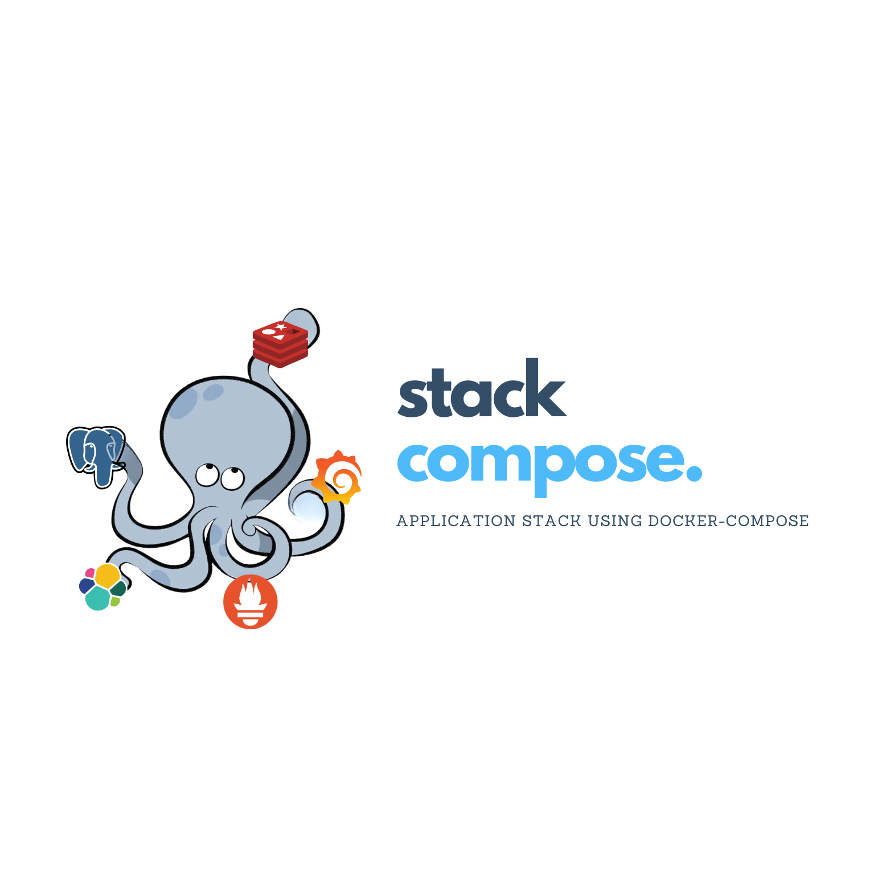

    

# The Application stack in docker-compose Library

Popular application, containerized in docker-compose and ready to launch.

## Philosophy

This project strives to be the most accessible entry point for those wanting to experiment with building application stacks using Docker Compose.
It prioritizes a minimalist and unopinionated approach. There's a focus on minimal external dependencies and custom automation, ensuring a quick and easy setup.

Instead, i believe in good docs so that you can use this repository as a template, tweak it, and make it **your own**.

## Why use Bitnami Image?

In this project, i primarily leverage Docker Image from Bitnami. Here's why:

- Bitnami closely tracks upstream source changes and promptly publishes new versions of this image using our automated systems.
- With Bitnami images the latest bug fixes and features are available as soon as possible.
- Bitnami containers, virtual machines and cloud images use the same components and configuration approach - making it easy to switch between formats based on your project needs.
- All our images are based on [**minideb**](https://github.com/bitnami/minideb) -a minimalist Debian based container image that gives you a small base container image and the familiarity of a leading Linux distribution- or **scratch** -an explicitly empty image-.
- All Bitnami images available in Docker Hub are signed with [Notation](https://notaryproject.dev/). [Check this post](https://blog.bitnami.com/2024/03/bitnami-packaged-containers-and-helm.html) to know how to verify the integrity of the images.
- Bitnami container images are released on a regular basis with the latest distribution packages available.

* _copy from Bitnami docs :))_

Utilizing Bitnami Docker images may introduce certain differences compared to employing official images.
Nonetheless, as outlined in the philosophy, my primary focus lies in facilitating rapid application deployment.
If you prefer using different images, feel free to clone this repository and customize it as per your requirements.

## Usage

Updating ...

## Contributing

Updating ...

## License

Updating ...
